# Anjuna Seaglass GCP CI/CD Howto:

This repository contains a Docker image with Anjuna GCP CLI pre-installed, designed for use in CI/CD pipelines on Google Cloud Platform. The image facilitates the creation and management of Anjuna environments on Google Cloud.



## Table of Contents

- [Prerequisites](#prerequisites)
- [Dockerfile & Google Secret Setup](#dockerfile-&-google-secrets-setup)
- [Building and Pushing the Docker Image](#building-and-pushing-the-docker-image)
- [Setting Up Google Cloud Build](#setting-up-google-cloud-build)
- [Cloud Build Configuration](#cloud-build-configuration)
- [Environment Variables](#environment-variables)
- [Usage](#usage)

## Prerequisites

- Google Cloud SDK installed and configured.
- Google Cloud project with Artifact Registry enabled.
- Service account with necessary permissions and a key file.
- Anjuna API Token.

## Dockerfile & Google Secrets Setup

```bash
Setting up your Google Secrets for Anjuna Token:
read -sp "Enter your Anjuna Auth Token: " ANJUNA_AUTH_TOKEN
echo
echo -n "$ANJUNA_AUTH_TOKEN" | gcloud secrets create anjuna-auth-token --data-file=- --replication-policy="automatic"
unset ANJUNA_AUTH_TOKEN
```

The Dockerfile installs Docker and Anjuna CLI, ensuring the build node has the necessary tools.

```Dockerfile
# Use a base image with necessary tools
FROM ubuntu:20.04

# Define build argument for Anjuna Auth Token
ARG ANJUNA_AUTH_TOKEN

# Install necessary dependencies
RUN apt-get update && \
    apt-get install -y wget curl sudo gnupg lsb-release software-properties-common && \
    apt-get install -y docker.io

# Add Docker group and user modification commands
RUN groupadd docker && \
    usermod -aG docker $USER

# Download and install Anjuna CLI
RUN wget https://api.downloads.anjuna.io/v1/releases/anjuna-gcp-installer.release-1.11.0004.bin --header="X-Anjuna-Auth-Token:${ANJUNA_AUTH_TOKEN}" && \
    chmod +x anjuna-gcp-installer.release-1.11.0004.bin && \
    ./anjuna-gcp-installer.release-1.11.0004.bin && \
    rm anjuna-gcp-installer.release-1.11.0004.bin

# Source Anjuna environment variables
RUN echo 'source /opt/anjuna/gcp/env.sh' >> ~/.bashrc

# Set the entrypoint to the bash shell
ENTRYPOINT ["/bin/bash"]
```

## Building and Pushing the Docker Image

```bash
# Set your Google Cloud project ID
export PROJECT_ID="YOUR_PROJECT_ID"

# Build Docker image
docker build -t anjuna-gcp-cli:latest .

# Authenticate with Google Cloud
gcloud auth login
gcloud auth configure-docker us-central1-docker.pkg.dev

# Create Artifact Registry repository
gcloud artifacts repositories create my-repo --repository-format=docker --location=us-central1 --project=$PROJECT_ID

# Tag Docker image
docker tag anjuna-gcp-cli:latest us-central1-docker.pkg.dev/$PROJECT_ID/my-repo/anjuna-gcp-cli:latest

# Push Docker image to Artifact Registry
docker push us-central1-docker.pkg.dev/$PROJECT_ID/my-repo/anjuna-gcp-cli:latest

# Example command to run the container
echo "To run the container, use the following command:"
echo "docker run -it --rm -v $HOME/.config/gcloud:/root/.config/gcloud us-central1-docker.pkg.dev/$PROJECT_ID/my-repo/anjuna-gcp-cli:latest"
```

## Setting Up Google Cloud Build

1. **Authenticate with Google Cloud**:
   ```bash
   gcloud auth login
   gcloud auth configure-docker
   ```

2. **Create a Google Artifact Registry repository** (if not already created):
   ```bash
   gcloud artifacts repositories create my-repo --repository-format=docker --location=us-central1
   ```

3. **Ensure the service account has necessary permissions**:
   - Compute Admin
   - Storage Admin
   - Artifact Registry Reader

## Cloud Build Configuration

Create a `cloudbuild.yaml` file with the following content:

```yaml
steps:
# Step 1: Authenticate with Google Cloud
- name: 'gcr.io/cloud-builders/gcloud'
  entrypoint: 'bash'
  args:
  - '-c'
  - |
    gcloud auth activate-service-account --key-file=${GOOGLE_APPLICATION_CREDENTIALS}
    gcloud config set project $PROJECT_ID

# Step 2: Retrieve the Anjuna Auth Token from Secret Manager
- name: 'gcr.io/cloud-builders/gcloud'
  entrypoint: 'bash'
  args:
  - '-c'
  - |
    export ANJUNA_AUTH_TOKEN=$(gcloud secrets versions access latest --secret="anjuna-auth-token")

# Step 3: Use the Docker image to run commands with the token
- name: 'us-central1-docker.pkg.dev/YOUR_PROJECT_ID/my-repo/anjuna-gcp-cli:latest'
  entrypoint: 'bash'
  args:
  - '-c'
  - |
    echo "Step 1: Test Docker installation and Anjuna CLI availability"
    docker --version
    anjuna-gcp-cli version

    echo "Step 2: Create a disk using Anjuna CLI"
    anjuna-gcp-cli disk create --docker-uri=nginx:latest --size 20G

    echo "Step 3: Upload the disk to a Google Cloud Storage bucket"
    export RANDOM_SUFFIX=$(cat /dev/urandom | LC_ALL=C tr -dc "[:lower:]" | head -c 10)
    export BUCKET_NAME="anjuna-gcp-nginx-bucket-${RANDOM_SUFFIX}"
    export IMAGE_NAME="anjuna-gcp-nginx-image"
    anjuna-gcp-cli disk upload --bucket=${BUCKET_NAME} --image=${IMAGE_NAME}

    echo "Step 4: Create a network and firewall rule"
    export NETWORK_NAME="anjuna-gcp-network"
    gcloud compute networks create ${NETWORK_NAME}
    gcloud compute firewall-rules create anjuna-gcp-rule-http --network ${NETWORK_NAME} --allow tcp:80

    echo "Step 5: Create a service account and assign roles"
    export SERVICE_ACCOUNT_NAME=anjuna-nginx-service-account
    export GCP_PROJECT=$(gcloud config get project)
    export SERVICE_ACCOUNT_EMAIL="${SERVICE_ACCOUNT_NAME}@${GCP_PROJECT}.iam.gserviceaccount.com"
    gcloud iam service-accounts create ${SERVICE_ACCOUNT_NAME} --description="Service Account for Anjuna Nginx Quickstart" --display-name="Anjuna Nginx Quickstart"
    gcloud projects add-iam-policy-binding ${GCP_PROJECT} --member="serviceAccount:${SERVICE_ACCOUNT_EMAIL}" --role="roles/logging.logWriter"

    echo "Step 6: Create an instance using Anjuna CLI"
    export INSTANCE_NAME=anjuna-gcp-nginx-instance
    anjuna-gcp-cli instance create --instance=${INSTANCE_NAME} --image=${IMAGE_NAME} --network=${NETWORK_NAME} --service-account=${SERVICE_ACCOUNT_EMAIL}

    echo "Step 7: Describe the instance to get attestation report"
    anjuna-gcp-cli instance describe --instance=${INSTANCE_NAME} --attestation-report

    echo "Step 8: Get the external IP address and make a curl request"
    export IP_ADDRESS=$(anjuna-gcp-cli instance describe --instance=${INSTANCE_NAME} --show-ip | egrep -m 1 -i "AccessConfig: External NAT IpAddr:\\s*[0-9]+" | sed -E 's/.*IpAddr\\:\\s*([0-9.]+).*/\\1/')
    curl ${IP_ADDRESS}:80

    echo "Step 9: Retrieve instance logs"
    anjuna-gcp-cli instance describe --instance=${INSTANCE_NAME} --logs --tail

    echo "Step 10: Delete the instance"
    anjuna-gcp-cli instance delete --instance=${INSTANCE_NAME}

# Specify the image to be used in the build steps
images:
- us-central1-docker.pkg.dev/YOUR_PROJECT_ID/my-repo/anjuna-gcp-cli:latest

# Set environment variables
env:
- PROJECT_ID=your-google-cloud-project-id
- GOOGLE_APPLICATION_CREDENTIALS=/path/to/your/service-account-key.json

# Define secret environment variables
secretEnv:
- ANJUNA_AUTH_TOKEN

secrets:
- kmsKeyName: projects/YOUR_PROJECT_ID/locations/global/keyRings/YOUR_KEYRING/cryptoKeys/YOUR_KEY
  secretEnv:
    ANJUNA_AUTH_TOKEN: projects/YOUR_PROJECT_ID/secrets/anjuna-auth-token/versions/latest
```

## Environment Variables

- `PROJECT_ID`: Your Google Cloud project ID.
- `GOOGLE_APPLICATION_CREDENTIALS`: Path to your Google Cloud service account key file.

## Usage

1. **Ensure the Docker image is built and pushed to Google Artifact Registry**.
2. **Create and configure the `cloudbuild.yaml` file** with the appropriate steps and environment variables.
3. **Trigger the build** using Google Cloud Build:

   ```bash
   gcloud builds submit --config cloudbuild.yaml .
   ```

This will run the steps defined in `cloudbuild.yaml`, leveraging the pre-built Docker image to set up and manage the Anjuna environment on Google Cloud.

## Additional Notes

- Ensure your service account has the necessary permissions to execute the steps in the `cloudbuild.yaml` file.
- Replace placeholders such as `YOUR_PROJECT_ID`, `your-google-cloud-project-id`, and `/path/to/your/service-account-key.json` with actual values specific to your environment.
- The Docker image and `cloudbuild.yaml` configuration should be updated as necessary to fit your specific use case and requirements.
